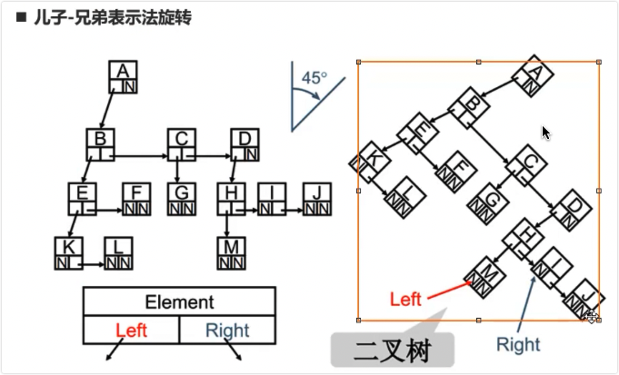
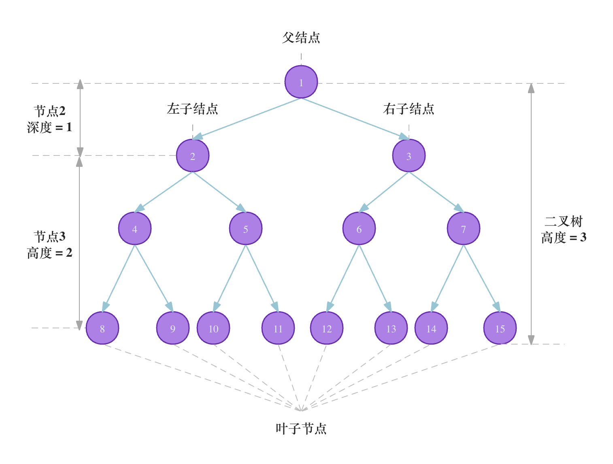
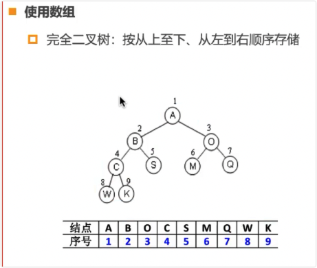

# 二叉树

- 二叉树(binary tree)通常是指没个节点最多有两个子节点的树结构,通常左侧节点被称为“左子树”,右侧节点被称为“右子树”.
- 本质上所有的树都可以用二叉树模拟出来

## 二叉树的特性

- 一颗二叉树第i层的最大节点数为：2^i - 1 >= 1
- 深度为k的二叉树有最大节点总数为：2^(k + 1) - 1, k >= 1
- 对任何非空二叉树T，若n0表示叶节点的个数，n2是度为2的非叶节点个数，那么两者满足关系n0 = n2 + 1

## 二叉树常见术语

> 请注意，我们通常将“高度”和“深度”定义为“经过的边的数量”，但有些题目或教材可能会将其定义为“经过的节点的数量”。在这种情况下，高度和深度都需要加 1 。
> https://www.zhihu.com/question/40286584 > https://stackoverflow.com/questions/2603692/what-is-the-difference-between-depth-and-height-in-a-tree

- 根节点（root node）：位于二叉树的顶层，妹没有父节点
- 叶节点（leaf node）：没有子节点，其两个指针均指向null，节点度为0
- 边（edge）：连接两个节点的线段，即节点的引用（指针）
- 层（level）：从顶层至底层递增，根节点为1
- 节点的度（degree）：节点子节点的数量，二叉树中取值范围是0、1、2
- 二叉树的高度（height）：从根节点到最远叶节点的边的数量
- 节点的深度（depth）：从根节点到该节点所经过的边的数量
- 节点的高度（height）： 从最远叶节点到该节点所经过边的数量

## 二叉树类型

- 完美二叉树 - 满二叉树
- 完全二叉树 - 只有最底层的节点未被填满，且最底层节点尽量靠左填充。
- 满二叉树 - 除了叶节点之外，其余所有节点都有两个子节点
- 平衡二叉树 - 任意节点的左子树和右子树的高度之差的绝对值不超过 1 。

### 完美二叉树(满二叉树)

所有层的节点都被完全填满。在完美二叉树中，叶节点的度为 0，其余所有节点的度都为 2；若树的高度为 h，则节点总数为 2^(h+1) - 1，呈现标准的指数级关系，反映了自然界中常见的细胞分裂现象。

### 完全二叉树

只有最底层的节点未被填满，且最底层节点尽量靠左填充，只缺右侧若干节点

- 大顶堆 - 父结点比左子节点和右子节点都要大
- 小顶堆 - 父节点比左子节点和右子节点都要小
- 顶堆的计算:
  - 下标为i的节点的父结点下标: (i - 1) / 2
  - 下标为i的节点的左子节点下标: i \* 2 + 1
  - 下标为i的节点的右子节点下标: i \* 2 + 2

### 完满二叉树

### 平衡二叉树

### 二叉搜索树

- BST，Binary Search Tree,也称二叉排序树或二叉查找树
- 非空左子树的所有键值小于其根节点的键值
- 非空右子树的所有键值大于其根节点的键值
- 左、右子树本身也都是二叉搜索树
- 这种树的查找就是二分查找思想，查找所需的最大次数等于二叉搜索树的深度
- 查找树的最大值和最小值是最方便的

## 二叉树退化

- 当二叉树的每层节点都被填满时，达到“完美二叉树”；而当所有节点都偏向一侧时，二叉树退化为“链表”。

## 遍历

- 先序遍历
- 中序遍历
- 后序遍历
- 层序遍历

### 先序遍历

根节点 -> 左子节点 -> 右子节点

### 中序遍历

左子节点 -> 根节点 -> 右子节点

### 后续遍历

左子节点 -> 右子节点 -> 根节点

### 层序遍历

一层一层的遍历
