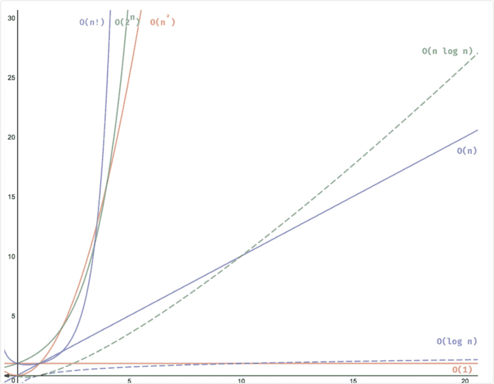
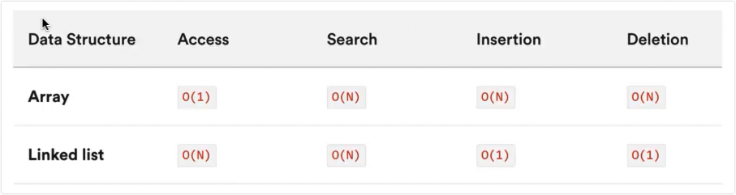

# 时间复杂度

发生过几次常数操作的指标

## 统计时间增长趋势

时间复杂度的分析统计的不是算法运行的时间，**而是算法运行时间随着数据量变大时的增长趋势**

### 时间复杂度的特点

1. 时间复杂度可以有效的评估算法的效率
2. 时间复杂度的推算方法更简单
3. 时间复杂度也存在一定的局限性

### 大O表示法

Big O notation - 大 O 符号，也被称为兰道符号，代表 order of... (...阶)

### 时间复杂度 O()

- 常数阶：O(1)
- 对数阶：O(log n)，常出现在基于分治策略的算法中，体现了“一分为多”和“化繁为简”的算法思想
- 线性阶：O(n)
- 线性对数阶：O(n log n)
- 平方阶：O(n²)
- 指数阶：O(2 \*\* n)
- 阶乘阶：O(n!)

#### 数组和链表的复杂度对比

